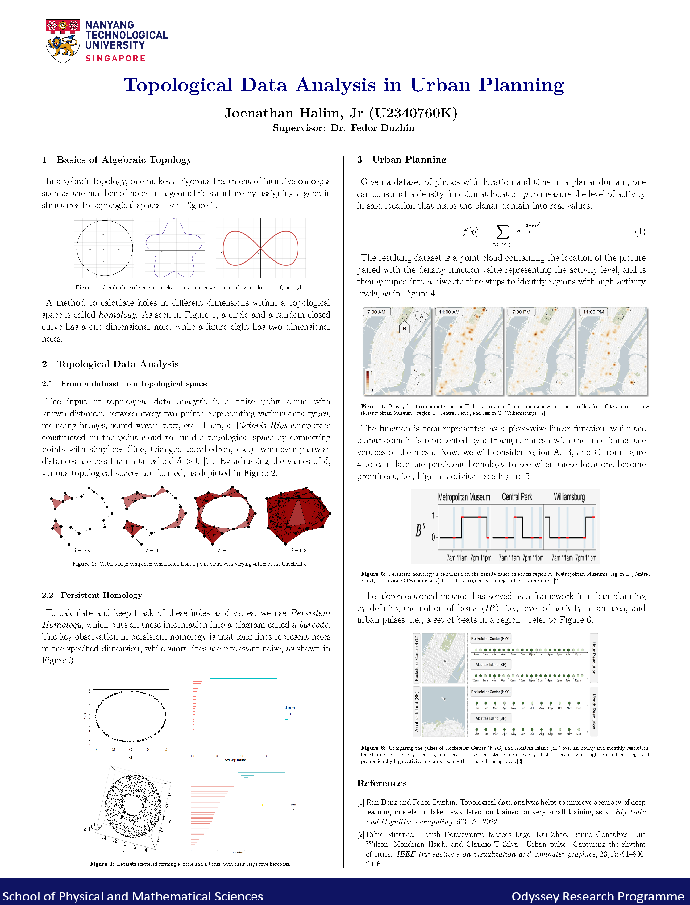

# Topological-Data-Analysis-in-Urban-Planning

The following picture is my research paper for the odyssey program

## Summary
I introduce the concept of algebraic topology to urban planning. Specifically, it is used to define a metric that records the level of activity in a location over several temporal resolutions. Formally, this is called a beat, and the set of beats over several temporal resolutions is called a pulse.
